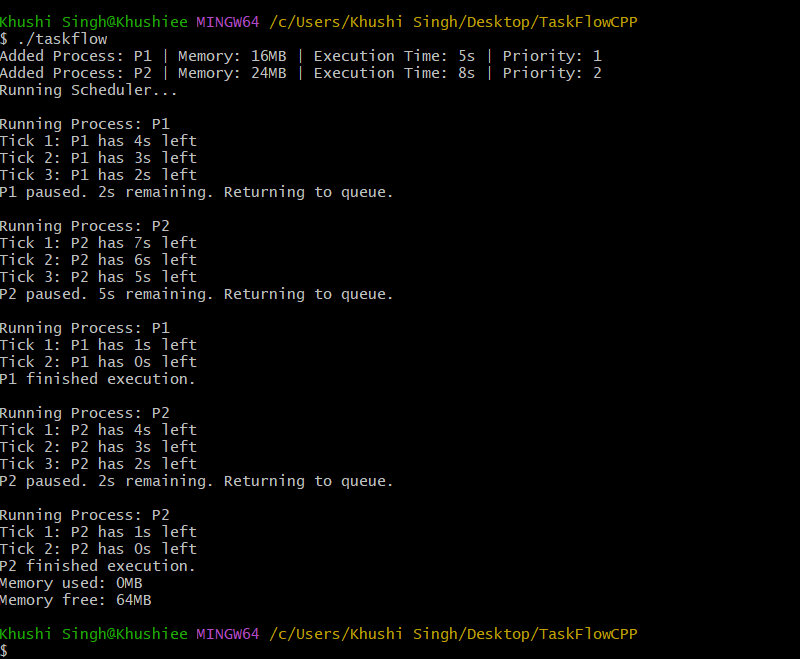

# 🚀 TaskFlow++  
### 🧠 Mini OS Scheduler & Memory Manager in C++

**TaskFlow++** is a lightweight C++ project that simulates how an operating system schedules processes and manages RAM. It uses Round Robin CPU scheduling and dynamic memory allocation to mimic how real multitasking works inside modern operating systems.


---
### ❓ What Problem Does It Solve?

Modern operating systems need to efficiently manage multiple processes competing for limited CPU and memory. TaskFlow++ solves this by simulating a **process scheduler** and **memory manager** in C++, helping students and developers understand:

- 🔁 How OS schedules processes using **Round Robin**
- 💾 How memory is **dynamically allocated & freed**
- ⏱️ How CPU time is fairly distributed between tasks
- 🧠 How multitasking works internally in OS kernels

This simulation makes abstract OS concepts **visual, testable, and hands-on** — perfect for learning, interviews, and system design practice.


---

## 📸 Demo Screenshots


### ➕ Output


---

## 🚀 How to Use TaskFlow++

Anyone can try out TaskFlow++ on their machine by following these simple steps:

### 📥 1. Clone the Repository
```bash
git clone https://github.com/mekhushi/TaskFlowCPP.git
cd TaskFlowCPP

```
## 🛠️ 2. Compile the Project
🪟 On Windows (Git Bash / MSYS2):
```bash
g++ main.cpp process.cpp scheduler.cpp memory_manager.cpp -o taskflow
```
---

## ▶️ 3. Run the Simulator
```bash
./taskflow


``
